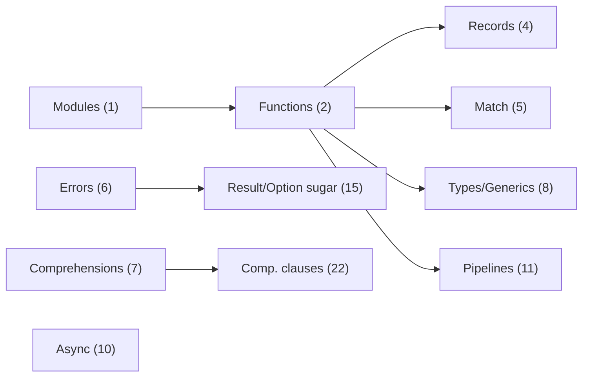
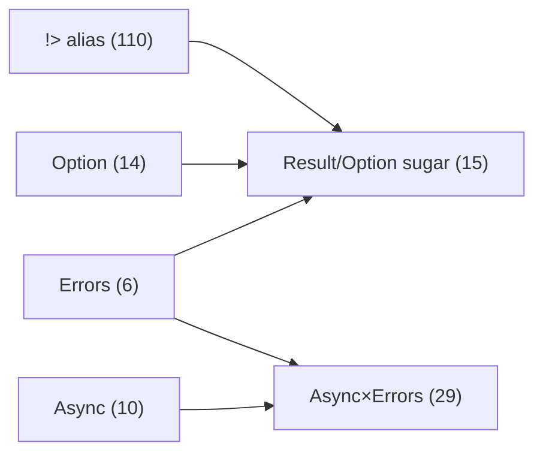
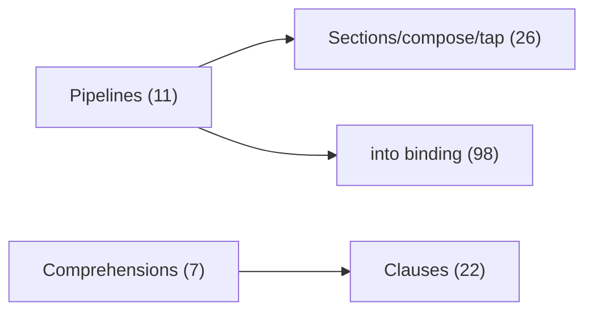
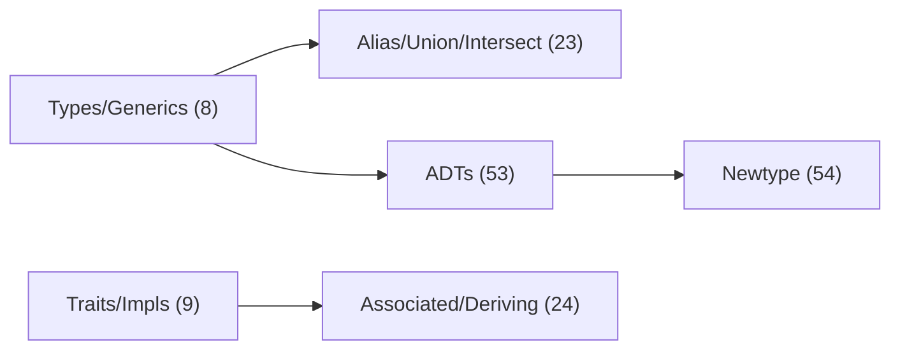

Quick links: [ISO Phase 1](#iso-ebnf-cleanup-plan-phase-1) · [ISO Phase 2](#iso-ebnf-cleanup-plan-phase-2) · [Homoiconicity](#homoiconicity-preservation-plan) · [High-Level Tasks](#high-level-constructions-ebnf-plan) · [Extensions](#extensions-additional-tasks) · [Grouped Index](#grouped-task-index) · [Diagrams](../../../DIAGRAMS.md)

> Docs status: Unreleased (updated 2025-10-15). See [CHANGELOG](../../../CHANGELOG.md#2025-10-15).

## Table of Contents

- [ISO EBNF Cleanup Plan (Phase 1)](#iso-ebnf-cleanup-plan-phase-1)
- [ISO EBNF Cleanup Plan (Phase 2)](#iso-ebnf-cleanup-plan-phase-2)
- [Homoiconicity Preservation Plan](#homoiconicity-preservation-plan)
- [High-Level Constructions EBNF Plan](#high-level-constructions-ebnf-plan)
- [Extensions (additional tasks)](#extensions-additional-tasks)
- [Per-task dependencies (explicit)](#per-task-dependencies-explicit)
- [Grouped Task Index](#grouped-task-index)
- [Diagrams](../../../DIAGRAMS.md)

## Shortlist (Next)

- [Types/generics (as/of)](#8-type-annotations-and-generics-as-of-operators)
- [Zig-style error handling](#6-zig-style-error-handling)
- [Option generic](#14-option-generic-optional-values)
- [Result/Option sugar](#15-syntax-sugar-for-result-and-option)
- [Async/await](#10-async--await)
- [Integration: Async x Errors](#29-integration-async-concurrency-x-zig-style-error-handling)
- [Pipeline with placeholders](#11-pipeline-with-placeholders)
- [Pipeline "into" binding](#98-pipeline-into-binding)
- [Records and destructuring](#4-records-and-destructuring)
- [Pattern matching](#5-pattern-matching)
- [String interpolation](#38-string-interpolation)
- [Units of measure](#50-units-of-measure)

[Back to top](#table-of-contents) · [Back to index](#grouped-task-index)

## Profiles / Tags index

- Profiles
  - [Profile A (S-expr)](#1-modules-and-imports)
  - [Profile B (infix/pipeline)](#11-pipeline-with-placeholders)
  - [Profile C (indentation)](#2-function-definitions-multi-clause-optional)

- Browse by tag
  - [modules](#1-modules-and-imports)
  - [functions](#2-function-definitions-multi-clause-optional)
  - [bindings](#3-let-where-bindings)
  - [records](#4-records-and-destructuring)
  - [patterns](#5-pattern-matching)
  - [errors](#6-zig-style-error-handling)
  - [comprehensions](#7-comprehensions)
  - [types](#8-type-annotations-and-generics-as-of-operators)
  - [traits](#9-traits--protocols-and-implementations)
  - [async](#10-async--await)
  - [pipelines](#11-pipeline-with-placeholders)
  - [option](#14-option-generic-optional-values)
  - [result](#15-syntax-sugar-for-result-and-option)
  - [macros](#30-macros-and-hygiene-optional)
  - [ffi](#35-foreign-function-interface-ffi)

## Dependency graphs (Mermaid)

### Core high-level tasks

### Errors / Option / Async integration

### Pipelines & Comprehensions

### Types & Traits

# ISO EBNF Cleanup Plan (Phase 1)

Scope: Bring all EBNF docs in this repo into strict ISO/IEC 14977 shape while keeping semantics unchanged.

## Tasks
 - Dependencies (all tasks in this section): All EBNF docs in this repo (01–16, profiles.md profiles); edits apply across files as noted.

1. Audit all EBNF docs for non-ISO constructs and inconsistencies
   - Explanation: Locate all non-ISO patterns and inconsistencies to scope exact edits across the repo.
   - Find Unicode ellipses, regex-like shorthand, mixed quoting, bare prose tokens.
2. Standardize terminal quoting to double quotes across files
   - Explanation: Use one terminal quoting style so grammars are unambiguous and tool-friendly.
   - Only use "..." for terminals; use single quotes only to denote a double quote within string rules.
3. Expand ellipsis ranges to explicit alternatives (02, 03, 04, 10–13)
   - Explanation: Replace range shorthands with explicit terminals to satisfy ISO metasymbol constraints.
   - Replace ranges like A | ... | Z with explicit terminals.
4. Wrap prose tokens in special sequences
   - Explanation: Keep out-of-band semantics inside `? ... ?` to maintain strict EBNF syntax.
   - Ensure EOF, newline policies, and "any char except ..." appear only inside `? ... ?`.
5. Unify skippers
   - Explanation: Provide one `_`/`whitespace`/`comment` shape to avoid divergent lexing assumptions.
   - One `_` rule per file using shared `whitespace` and `comment` definitions.
6. Normalize string and escape rules
   - Explanation: Use a single string/escape definition to eliminate ambiguities and ease reuse.
   - Use `string = '"' , { string_char } , '"' ;`
   - `string_char = escape | ? any char except " and \\ ? ;`
   - `escape = "\\" , ( "\\" | '"' | "n" | "t" | "r" ) ;`
7. Normalize number rules
   - Explanation: Keep base/exactness via terminals and notes; avoid regex-like notations in grammar.
   - Keep base/exactness via terminals (e.g., `xdigit`); avoid regex-like notation; put validation in notes.
8. Normalize operator sets (opchar)
   - Explanation: Enumerate operator characters explicitly for portability and clarity.
   - Explicitly enumerate operator characters as quoted terminals.
9. Formalize indentation tokens in prose/special sequences (04, 14–16)
   - Explanation: Model offside behavior as lexer semantics documented via comments/special sequences.
   - Describe NEWLINE/INDENT/DEDENT as lexer behavior using comments / `? ... ?` only.
10. Update README/profiles.md with ISO conformance notes and caveats
    - Explanation: Document what the grammar guarantees and where scanner semantics apply.
   - Document where lexer semantics apply and what's enforced by grammar vs scanner.

## Deliverables

- Updated EBNF files with consistent metasymbols and terminal quoting.
- No Unicode ellipses; only ASCII `...` in prose/examples.
- Unified string/escape and comment rules across profiles.
- README and `profiles.md` sections stating conformance and lexer-semantics boundaries.

## Acceptance Criteria

- No occurrences of Unicode ellipsis `…` anywhere.
- All `letter`/`digit` ranges enumerated; no range shorthands.
- Every `comment` rule consumes up to `"\n" | "\r\n" | ? EOF ?`.
- Every `string` uses `string_char`/`escape` pattern above.
- All prose tokens wrapped in `? ... ?` or moved to comments.

[Back to top](#table-of-contents) · [Back to index](#grouped-task-index)

---

# ISO EBNF Cleanup Plan (Phase 2)

Scope: Refine inconsistencies left after Phase 1; make wording and rule shapes uniform across all files and profiles.

## Tasks
 - Dependencies (all tasks in this section): 01-sexpr, 03-infix (lexemes), 04-indentation, profiles.md profiles.

1. Standardize string/escape wording everywhere
   - Explanation: Ensure identical wording/symbol escaping across files to prevent drift.
   - In `01-sexpr-ebnf.md` and `ebnb.md` (Profile A), replace
     - `string_char = escape | ? any char except " and \ and control ? ;`
     - with `string_char = escape | ? any char except " and \\ ? ;`
   - Ensure `escape = "\\" , ( "\\" | '"' | "n" | "t" | "r" ) ;` is used verbatim in all files defining `string`.

2. Normalize comment rule shape in indentation grammar
   - Explanation: Align comment trailing-newline handling with the rest of the repo in indentation grammar.
   - In `04-indentation-ebnf.md` (and Profile C in `profiles.md`), set
     - `comment = "#" , { ? any char except newline ? } , ( "\n" | "\r\n" | ? EOF ? ) ;`
   - Keep offside/NEWLINE/INDENT/DEDENT behavior unchanged; only unify the `comment` production.

3. Unify "any char except …" phrasing
   - Explanation: Use consistent phrasing and escaping (notably backslash) in special sequences.
   - In `05-keywords-and-escaped-symbols-ebnf.md` and `profiles.md` Profile A:
     - `bar_char = sym_escape | ? any char except | and \\ ? ;` (backslash doubled)
   - In all `block_char` specials: keep "the sequences "#|" and "|#" phrasing, with quotes.

4. Consistency pass
   - Explanation: Final uniformity sweep: endings, expansions, and example comment markers.
   - Verify every `comment` production ends with `( "\n" | "\r\n" | ? EOF ? )`.
   - Verify unified letter/digit expansions and absence of range shorthand.
   - Ensure all examples use `#` for line comments.

5. Optional canonical snippet (if desired)
   - Explanation: Centralize common lexical definitions to reduce duplication.
   - Add a short "Common Lexical Snippets" section at the top of `profiles.md` and reference it from profiles.

## Deliverables

- Updated `01-sexpr-ebnf.md`, `04-indentation-ebnf.md`, `05-keywords-and-escaped-symbols-ebnf.md`, and `profiles.md` with unified wording and rule shapes.
- All string/escape and comment productions identical in form across files that define them.
- Example blocks use `#` consistently for comments.

## Acceptance Criteria

- No occurrences of the phrase "and control" in any `string_char` rule.
- All `string_char` rules read exactly: `string_char = escape | ? any char except " and \\ ? ;`.
- All `comment` rules read exactly: `comment = "#" , { ? any char except newline ? } , ( "\n" | "\r\n" | ? EOF ? ) ;` (unless a file intentionally omits comment support).
- All `bar_char` and `block_char` specials use escaped backslash and quoted delimiters.

[Back to top](#table-of-contents) · [Back to index](#grouped-task-index)

---

# Homoiconicity Preservation Plan

Scope: Ensure all surface profiles (infix, precedence, pipeline, indentation) preserve homoiconicity by desugaring to canonical S-expressions before macro-expansion and evaluation.

## Tasks
 - Dependencies (all tasks in this section): 01-sexpr (core), 03-infix, 04-indentation; profiles.md profiles to host mappings.

1. Author core S-expression contract
   - Explanation: Define the canonical program/data forms that all surfaces must target.
   - Define canonical forms: list, symbol, number, string, boolean, vector, map, set, and quote/quasiquote/unquote/unquote-splicing mapping.
   - Specify evaluation pipeline: desugar → macroexpand → evaluate over S-expressions.

2. Add desugaring-to-S-expr sections per profile
   - Explanation: Make each surface mapping explicit to ensure preserved homoiconicity.
   - 03 (infix base): `a op b` ⇒ `(op a b)`; mixing with application; non-assoc default.
   - 10/11/12/13 (expr variants): app fold-right; prefix/postfix nesting; two-tier precedence; pipeline threading as last argument.
   - 04 (indentation): map `if/elif/else`, `while`, `for`, `def`, and simple statements to canonical S-expr forms.
   - 14/15/16 (indent variants): confirm `:` optionality, one-line suites, and trailing-op join are sugar-only (no change to S-expr output).

3. Update profiles in `profiles.md`
   - Explanation: Provide mapping tables and examples where users select profiles.
   - Add per-profile mapping tables (surface → S-expr) and 2–3 round-trip examples each (surface → S-expr → printed S-expr).

4. Extend README Homoiconicity section
   - Explanation: Clarify the desugaring order and quote semantics in one place.
   - Document desugaring order, invariants (no information loss in S-expr), and quasiquote semantics over the S-expr representation.

5. Optional: Round-trip test fixtures (if adding tests later)
   - Explanation: Validate that surfaces reduce to the documented S-exprs in practice.
   - Include sample inputs and expected S-expr outputs for each profile.

## Deliverables

- Added desugaring sections to `03`, `04`, `10`, `11`, `12`, `13`, `14`, `15`, `16`.
- Updated `profiles.md` with mapping tables and round-trip examples per profile.
- Updated `README.md` Homoiconicity section with desugaring order and invariants.

## Acceptance Criteria

- Every surface construct (infix/prefix/postfix/precedence/pipeline/indentation) has an explicit S-expr mapping documented.
- The documented evaluation order is: desugar → macroexpand → evaluate (S-exprs only).
- At least two round-trip examples per profile produce the same printed S-exprs as specified.

[Back to top](#table-of-contents) · [Back to index](#grouped-task-index)

---

# High-Level Constructions EBNF Plan

Scope: Add modular EBNF variants for high-level constructs with both S-expression and surface forms, all desugaring to canonical S-expressions to preserve homoiconicity.

## Tasks
 - Dependencies (default for tasks below): 01-sexpr; optional 03-infix (operators) and 04-indentation (surface); 10–13 for expression tiers. Override per task when noted.

### Mini-TOC (High-Level tasks)

- [1. Modules and imports](#1-modules-and-imports)
- [2. Function definitions (multi-clause optional)](#2-function-definitions-multi-clause-optional)
- [3. Let/where bindings](#3-let-where-bindings)
- [4. Records and destructuring](#4-records-and-destructuring)
- [5. Pattern matching](#5-pattern-matching)
- [6. Zig-style error handling](#6-zig-style-error-handling)
- [7. Comprehensions](#7-comprehensions)
- [8. Type annotations and generics (as/of operators)](#8-type-annotations-and-generics-as-of-operators)
- [9. Traits / protocols and implementations](#9-traits--protocols-and-implementations)
- [10. Async / await](#10-async--await)
- [11. Pipeline with placeholders](#11-pipeline-with-placeholders)
- [12. File organization and docs](#12-file-organization-and-docs)
- [13. Integration: Zig-style error handling × Type annotations/generics](#13-integration-zig-style-error-handling-x-type-annotations)
- [14. Option generic (optional values)](#14-option-generic-optional-values)
- [15. Syntax sugar for Result and Option](#15-syntax-sugar-for-result-and-option)

#### 1. Modules and imports
   - Explanation: Define module boundaries and import forms; works in S-expr and indentation profiles; stays homoiconic via `(module …)`/`(import …)`.
   - S-expr: `(module Name (import path [as alias] (item as) ...) form ...)`
   - Indentation: `module Name:`/suite; `import path [as alias]`
   - Desugar both ⇒ `(module ...)`, `(import ...)`.
   - Example: `module Math` and `import utils as U` ⇒ `(module Math (import utils as U) ...)`

#### 2. Function definitions (multi-clause optional)
   - Explanation: Uniform function declaration surface with optional arrow and clauses; lowers to `(defn …)`.
   - S-expr: `(defn f (args...) body)`
   - Indentation: `def f(args) [-> expr]` + suite
   - Desugar ⇒ `(defn ...)`.
   - Example: `def add(x as Int, y as Int) as Int -> x + y` ⇒ `(defn add (x y) (+ x y))`

#### 3. Let-Where Bindings
   - Explanation: Local bindings either head or tail style; canonicalizes to `(let ((x e) …) body)`.
   - S-expr: `(let ((x e) ...) body)`
   - Surface: `let { x = e; ... } in expr`
   - Desugar ⇒ `(let ...)`.
   - Example: `let { x = 1; y = 2 } in x + y` ⇒ `(let ((x 1) (y 2)) (+ x y))`

#### 4. Records and destructuring
   - Explanation: First-class product types with ergonomic construction/access; maps to tagged maps or ctor S-exprs.
   - Tagged map: `{ :type T, k : v, ... }`
   - Positional ctor: `T{ e1, e2, ... }`
   - Desugar ⇒ tagged map or `(new T (e1 e2 ...))` (choose one and document).
   - Example: `Point{1, 2}` ⇒ `{ :type Point, :x 1, :y 2 }`

#### 5. Pattern matching
   - Explanation: Declarative branching over algebraic data; compiles to `(match scrut …)`.
   - S-expr: `(match scrut (pat expr) ...)`
   - Indentation: `match expr` + cases with `->`
   - Desugar ⇒ `(match ...)`.
   - Example: `match opt` cases ⇒ `(match opt ((some x) x) ((none) 0))`

#### 6. Zig-style error handling
   - Explanation: Replace exceptions with error unions and explicit propagation/handling; integrates with pipelines and types.
   - Errors are values (error unions), no exceptions.
   - S-expr: `(try expr)` to propagate; `(catch expr handler)` to handle; `(error tag [payload])` to construct.
   - Surface: `try expr` ; `expr catch err -> expr` ; `error(.Tag[, payload])`.
   - Desugar ⇒ `try` → `(try e)` ; `e catch err -> body` → `(catch e (lambda (err) body))` ; `error(.Tag[, p])` → `(error Tag [p])`.
   - Example: `try open(path) catch e -> default` ⇒ `(catch (try (open path)) (lambda (e) default))`

#### 7. Comprehensions
   - Explanation: List/sequence builders with generators/guards; desugars to nested `(for …)`.
   - S-expr: `(for (x in xs (if p) ...) body)`
   - Surface: `[ expr | x in xs, if p, ... ]`
   - Desugar ⇒ `(for ...)`.
   - Example: `[ x * x | x in xs, if x > 0 ]` ⇒ `(for (x in xs (if (> x 0))) (* x x))`

#### 8. Type Annotations and Generics (as-of operators)
   - Explanation: VB-inspired `as`/`of` surface for types and generics; keeps type info in `(ann …)`/`(of …)`.
   - S-expr: `(ann x T)`; type application via `(of Name T ...)`
   - Surface: `x as T`, parameters `param as T`, return `Function f(a as T) as U`, generics `List of T`
   - Desugar ⇒ `x as T` → `(ann x T)`; `List of T` → `(of List T)`; apply to params via `(ann param T)` and to returns with a function return type annotation.
   - Generic type parameter lists: `function f (of T, U) (x as T) as U` ⇒ `(defn f (x) :ret U :tparams (T U) ...)`
   - Constraints (optional): `of T as new` | `of T as InterfaceName` | `of T as struct` | `of T as class` ⇒ attach constraint metadata to type params.
   - Nested generics: `Map of K, List of V` ⇒ `(of Map K (of List V))`.
   - Arrays/nullable (optional): `x as T()` ⇒ `(ann x (array T))`; `x as T?` ⇒ `(ann x (of Nullable T))`.
   - Type characters (optional, VB-style): `x%` (Integer), `x$` (String), `x!` (Single), `x#` (Double), `x&` (Long), `x@` (Decimal) ⇒ `(ann x <Type>)`.
   - Lexer/grammar note: reserve `as` and `of` as keywords in relevant profiles; exclude from operator `opchar` and identifiers.
   - Example: `userIds as List of Int` ⇒ `(ann userIds (of List Int))`

#### 9. Traits / protocols and implementations
   - Explanation: Ad-hoc polymorphism with separate interface and impl declarations; keeps S-expr forms `(trait …)`/`(impl …)`.
   - S-expr: `(trait T (m sig) ...)`, `(impl T Type (m body) ...)`
   - Indentation: `trait T:` suite; `impl T Type:` suite
   - Desugar ⇒ `(trait ...)`, `(impl ...)`.
   - Example: `trait Eq:` and `impl Eq Int:` ⇒ `(trait Eq (equals (T T) Bool))` / `(impl Eq Int (equals (lambda (a b) ...)))`

#### 10. Async / await
    - Explanation: Structured concurrency sugar; composes with error unions and timeouts; no change to core evaluation model.
   - S-expr: `(async e)`, `(await e)`
   - Surface: `async e`, `await e`
   - Desugar ⇒ S-expr forms.
   - Example: `await (async fetch url)` ⇒ `(await (async (fetch url)))`

#### 11. Pipeline with placeholders
    - Explanation: Readable left-to-right function application with holes; lowers to lambdas and standard calls.
   - Surface: `x |> f(_, y)`; allow `_` hole in arg list
   - Desugar ⇒ `(f x y)`; document multiple holes policy (error or numbered placeholders).
   - Example: `data |> map(_, f)` ⇒ `(map data f)`

#### 12. File organization and docs
    - Explanation: Keep variants modular with clear dependencies and homoiconicity notes across files.
   - Create `17-xx-*.md` files per construct (S-expr + surface), each with EBNF, desugaring table, examples, and dependencies.
   - Update `profiles.md` profiles with links and add examples; update `README.md` index.
   - Example: `17-modules-imports.md`, `17-errors-zig.md`, `17-types-as-of.md`

#### 13. Integration: Zig-style Error Handling x Type Annotations
    - Explanation: Specify typing rules and sugar interactions so async/errors/generics remain first-class yet homoiconic.
   - Type model: introduce `Result of T` (error union) and a canonical `Error` type; allow `err as Error` bindings.
   - S-expr mapping: `(of Result T)` for result types; `(try e)`; `(catch e (lambda (err) body))`; `(ann err Error)`.
   - Surface interactions: function returns `as Result of U`; generic params `of E` for error type when needed; `error(.Tag[, payload])` typed as `Error` or `Error of Payload`.
   - Type-directed desugaring: `try e` requires `e : Result of T` and yields `T`; `e catch err -> b` yields `T` with `err : Error`.
   - Grammar reservations: reserve `try`, `catch`, `error`, `as`, `of` where enabled; exclude from identifiers/opchar.
   - Add examples: function with `as Result of U`, use `try` within pipelines, and a `catch` with typed `err`.
   - Example: `def parse(s as String) as Result of Int -> try toInt s` ⇒ `(defn parse (s) (ann s String) (try (toInt s)) :ret (of Result Int))`

#### 14. Option generic (optional values)
    - Explanation: Optional values with `Option` and `T?` sugar; integrates with pattern matching and pipelines.
   - S-expr: `(of Option T)`; constructors `(some v)` and `none`.
   - Surface: `Option of T`; optional sugar `T?` for `Option of T` (policy switch).
   - Desugar ⇒ `T?` → `(of Option T)` (if enabled); `some e`/`none` map directly to constructors.
   - Type interactions: `x as Option of T`; pattern matching via existing `match` construct; pipeline compatibility unchanged.
   - Grammar reservations: reserve `Option`, `some`, `none`, and `?` suffix (if enabled) where profiles include this feature.
   - Example: `x as Option of Int; if some n <- x -> n else 0` ⇒ `(match x ((some n) n) ((none) 0))`

#### 15. Syntax sugar for Result and Option
    - Explanation: Ergonomics for common flows (coalesce, postfix try, if-some) without leaving the S-expr core.
   - S-expr targets (canonical forms):
     - Result coalesce: `res ?? def` ⇒ `(match res (ok x) x (err e) def)` or `(result-else res def)`.
     - Option coalesce: `opt ?? def` ⇒ `(match opt (some x) x (none) def)` or `(option-else opt def)`.
     - Postfix try: `e ?` ⇒ `(try e)` (uses existing postfix operator tier).
     - If-some binding: `if some x <- opt -> body [else alt]` ⇒ `match` over `opt`.
   - Surface:
     - Coalesce operator `??` at low precedence (below `+/-` and before pipeline) or as its own tier.
     - Postfix `?` as error propagation; keep `try e` as the keyword form.
     - Indentation sugar: `if some x <- opt -> expr [else expr]`.
     - Type sugar: `T!` in type positions is shorthand for `Result of T` (error union).
   - Precedence/grammar:
     - Add `"?"` and `"??"` to operator tokens; include `??` in minimal-precedence variant as lowest tier.
     - Reserve `some`, `none`, `<-` in contexts that enable the binding sugar.
     - Reserve `!` as a type-suffix token where the type grammar is active; avoid conflict with value-level postfix `!` if any.
   - Desugaring contract:
     - All sugar reduces to explicit `(match ...)`, `(try ...)`, and constructor forms `(ok ...)`, `(err ...)`, `(some ...)`, `none` in S-exprs.
     - `T!` ⇒ `(of Result T)`; e.g., `x as U!` ⇒ `(ann x (of Result U))`.
   - Examples: `res ?? 0` ⇒ `(result-else res 0)`; `value ?` ⇒ `(try value)`; `Int!` ⇒ `(of Result Int)`

## Deliverables

- New EBNF variant files for all constructs (`17-*.md`), each including S-expr and surface forms and explicit desugaring to S-exprs.
- Updated `profiles.md` with mapping tables and examples; updated `README.md` file index.

## Acceptance Criteria

- Each construct has: (a) S-expr grammar, (b) surface grammar (indentation/infix as applicable), and (c) desugaring rules to S-exprs.
- Examples round-trip: surface → S-expr → printed S-expr matches documented canonical form.
- No construct introduces evaluation semantics that bypass the S-expr core; homoiconicity preserved.

[Back to top](#table-of-contents) · [Back to index](#grouped-task-index)

## Per-task dependencies (explicit)

- Phase 1 (ISO cleanup)
  - Tasks [1](#1-modules-and-imports), [2](#2-function-definitions-multi-clause-optional), [3](#3-let-where-bindings), [4](#4-records-and-destructuring), [5](#5-pattern-matching), [6](#6-zig-style-error-handling), [7](#7-comprehensions), [8](#8-type-annotations-and-generics-as-of-operators), [9](#9-traits--protocols-and-implementations), [10](#10-async--await): 01-sexpr, 02-right-assoc, 03-infix, 04-indentation, 10–16 variants, `profiles.md`, `README.md`.

- Phase 2 (ISO cleanup wording)
  - Tasks [1](#1-modules-and-imports), [2](#2-function-definitions-multi-clause-optional), [3](#3-let-where-bindings), [4](#4-records-and-destructuring), [5](#5-pattern-matching): 01-sexpr, 03-infix (lexemes), 04-indentation, 05-keywords, `profiles.md`.

- Homoiconicity plan
  - Tasks [1](#1-modules-and-imports), [2](#2-function-definitions-multi-clause-optional), [3](#3-let-where-bindings), [4](#4-records-and-destructuring), [5](#5-pattern-matching): 01-sexpr (core), 03-infix, 04-indentation, 10–13 (expr tiers), `profiles.md` profiles, `README.md`.

- High-Level Constructions
  - 1 Modules/imports: 01, 04, `profiles.md`.
  - 2 Function defs: 01, 04 (indent), 10–13 (arrow/app tiers) if used.
  - 3 Let/where: 01, 03 (if mixing), `profiles.md`.
  - 4 Records/destructuring: 01, 09 (maps/sets), 03 (access op) if used.
  - 5 Pattern matching: 01, `profiles.md`.
  - 6 Zig errors: 01, 29 (async/error integration), 14–15 (Option/Result sugar) if referenced.
  - 7 Comprehensions: 01, 03 (expr) if filters/ops appear.
  - 8 Types/generics (as/of): 01, 03 (keywords), `profiles.md`.
  - 9 Traits/impls: 01, `profiles.md`.
  - 10 Async/await: 01, 25 (async), 29 (integration) if combined with errors.
  - 11 Pipeline placeholders: 03, 10–13 (pipeline tier), `profiles.md`.
  - 12 Files/docs: `profiles.md`, `README.md`.
  - 13 Integration (errors×types): 01, 29, 14–15, `profiles.md`.
  - 14 Option generic: 01, 05 (keywords), `profiles.md`.
  - 15 Result/Option sugar: 01, 10–13 (operators), 14 (Option), 29 (errors).

- Extensions (16–114)
  - 16 Exports/re-exports: 01, `profiles.md`.
  - 17 Function extras: 01, 04, 10–13.
  - 18 Where-block: 01, 03.
  - 19 Records access/update: 01, 09.
  - 20 Patterns or/as/guard: 01.
  - 21 Tagged catches/result piping: 01, 29, 15.
  - 22 Comprehension clauses: 01, 03.
  - 23 Types alias/union/intersect: 01, 08.
  - 24 Traits assoc/derive: 01, 09 (if records in traits), `profiles.md`.
  - 25 Async defer/errdefer/timeouts: 01, 29, 10–13 (if operators appear).
  - 26 Pipeline sections/tap: 03, 10–13.
  - 27 Option/Result extras: 01, 14–15.
  - 28 Docs/infra: `profiles.md`.
  - 29 Async×errors integration: 01, 25, 15.
  - 30 Macros/hygiene: 01 (quasiquote), 05 (escaped symbols).
  - 31 Attributes: 01.
  - 32 Generators/yield: 01.
  - 33 Ranges/slicing: 01, 12 (precedence) if operators used.
  - 34 Partial/sections: 03, 10–13.
  - 35 FFI: 01, 08 (chars/bytevectors) if types appear.
  - 36 Conditional compilation: `profiles.md` (preprocess policy).
  - 37 Do-notation: 01, 14–15, 25/29 depending on monad (Option/Result/Task).
  - 38 Interpolation: 01 (strings), 03 (expr), `profiles.md`.
  - 39 Named args: 01, 03.
  - 40 Lenses/updates: 01, 09.
  - 41 Pattern synonyms: 01, 30 (macros).
  - 42 SQL-like queries: 01, 03, 11 (pipeline) if piped.
  - 43 Effects/handlers: 01.
  - 44 Visibility per decl: 01.
  - 45 Using/rename imports: 01.
  - 46 Error context/tags: 01, 29.
  - 47 DSL fenced blocks: 01 (strings), `profiles.md`.
  - 48 Exhaustive match: 01.
  - 49 Contracts: 01.
  - 50 Units of measure: 01.
  - 51 Docstrings: 01.
  - 52 Assertions: 01.
  - 53 ADTs sum/product: 01, 08 (types/generics).
  - 54 Newtype: 01.
  - 55 Safe navigation: 01, 14 (Option).
  - 56 Ternary: 03, 12.
  - 57 Regex binders: 01 (strings), 09 (maps for captures) optionally.
  - 58 Duration/size literals: 01 (numbers), `profiles.md`.
  - 59 Lazy/force: 01.
  - 60 Match-lambda: 01.
  - 61 Parallel comprehensions: 01.
  - 62 Unicode operator aliases: 03.
  - 63 Wildcard imports with filters: 01.
  - 64 Property-based tests: 01.
  - 65 Finite state machines: 01.
  - 66 Memoization: 01.
  - 67 Cache with TTL: 01, 58 (duration literals).
  - 68 Using-binding: 01, 25, 29.
  - 69 Const-eval: 01, `profiles.md` (build policy).
  - 70 Date/time literals: 01.
  - 71 BigInt/Rational: 01 (numbers), 06 (radix/exactness) if extended.
  - 72 Path literals: 01 (strings), `profiles.md`.
  - 73 Open constructors: 01, 53 (ADTs).
  - 74 FRP streams: 01.
  - 75 JSON/YAML blocks: 01 (strings), `profiles.md`.
  - 76 Heredoc strings: 01 (strings).
  - 77 Scoped logging: 01.
  - 78 Permission requirements: 01.
  - 79 Labeled blocks: 01, 04 (indentation) if used.
  - 80 Typecase: 01, 08 (types) if symbolic types used.
  - 81 Bit literals/ops: 01 (numbers), 12 (precedence) for shifts.
  - 82 SIMD vectors: 01.
  - 83 Foreach index: 01.
  - 84 With-expression builder: 01, 09.
  - 85 Curry/uncurry: 01, 03 (operators) optionally.
  - 86 Destructuring params: 01, 04 (indent) if surface used.
  - 87 Clause guards: 01.
  - 88 Local trait impls: 01, 09, 24.
  - 89 Scoped imports lifetime: 01.
  - 90 Raw/byte strings: 01, 08 (bytevectors) optionally.
  - 91 Multi-assign destructuring: 01.
  - 92 Safe/forced cast: 01, 08 (types) if type names used.
  - 93 Non-null assertion: 01, 14 (Option).
  - 94 For-range step: 01, 33 (ranges) if present.
  - 95 Switch/case: 01.
  - 96 Module init/finalize: 01.
  - 97 Map/set builder: 01, 09.
  - 98 Pipeline into: 03, 11.
  - 99 Tail recursion attr: 01.
  - 100 Inline assembly: 01.
  - 101 Conditional/dynamic require: 01.
  - 102 View patterns: 01.
  - 103 Guard/early-exit: 01, 15 (Result sugar) if used.
  - 104 Do-while: 01.
  - 105 Foreach with index: 01.
  - 106 Advanced slicing: 01, 33.
  - 107 Retry/backoff: 01, 58 (duration literals) if backoff uses ms literals.
  - 108 Cancellation token: 01, 29.
  - 109 Dict/array patterns: 01, 09.
  - 110 Error-channel pipeline: 01, 15.
  - 111 With-context manager: 01, 25, 29.
  - 112 Module aliases: 01.
  - 113 Regex named groups: 01.
  - 114 Char range literals: 01.

---

# Grouped Task Index

- Core ISO compliance
  - Phase 1: Tasks [1](#1-modules-and-imports), [2](#2-function-definitions-multi-clause-optional), [3](#3-let-where-bindings), [4](#4-records-and-destructuring), [5](#5-pattern-matching), [6](#6-zig-style-error-handling), [7](#7-comprehensions), [8](#8-type-annotations-and-generics-as-of-operators), [9](#9-traits--protocols-and-implementations), [10](#10-async--await)
  - Phase 2: Tasks [1](#1-modules-and-imports), [2](#2-function-definitions-multi-clause-optional), [3](#3-let-where-bindings), [4](#4-records-and-destructuring), [5](#5-pattern-matching)

- Homoiconicity
  - Homoiconicity Preservation: Tasks [1](#1-modules-and-imports), [2](#2-function-definitions-multi-clause-optional), [3](#3-let-where-bindings), [4](#4-records-and-destructuring), [5](#5-pattern-matching)

- Modules & Packaging
  - Tasks: [1](#1-modules-and-imports) (Modules/imports), [12](#12-file-organization-and-docs) (Files/docs), [16](#16-module-extensions-exports-and-re-exports) (Exports/re-exports), [45](#45-import-usingopen-and-selective-rename) (Using/rename imports), [63](#63-wildcard-imports-with-filters) (Wildcard imports), [96](#96-module-initfinalize-blocks) (Module init/finalize), [112](#112-hierarchical-module-aliases) (Module aliases), [101](#101-conditionaldynamic-require) (Conditional/dynamic require), [69](#69-compile-time-evaluation) (Const-eval policy)

- Functions & Parameters
  - Tasks: [2](#2-function-definitions-multi-clause-optional) (Function defs), [17](#17-function-extras-defaults-named-args-variadics-overloads) (Function extras), [86](#86-destructuring-in-parameters) (Destructuring params), [87](#87-clause-guards-for-functions) (Clause guards), [99](#99-tail-recursion-annotation) (Tail recursion attr), [31](#31-attributes--annotations-on-declarations) (Attributes), [51](#51-docstrings) (Docstrings), [66](#66-memoization-attribute) (Memoization)

- Bindings & Variables
  - Tasks: [3](#3-let-where-bindings) (Let/where), [18](#18-where-block-tail-sugar) (Where-block), [91](#91-multi-assign-destructuring) (Multi-assign destructuring)

- Records / Types & Generics
  - Tasks: [4](#4-records-and-destructuring) (Records), [8](#8-type-annotations-and-generics-as-of-operators) (Types/generics), [23](#23-types-aliases-and-unionsintersections) (Type alias/union/intersect), [53](#53-algebraic-data-types-sumproduct) (ADTs), [54](#54-newtype-wrappers) (Newtype), [50](#50-units-of-measure) (Units), [71](#71-bigintrational-numerics) (BigInt/Rational), [114](#114-char-range-literals) (Char ranges)

- Pattern Matching & Synonyms
  - Tasks: [5](#5-pattern-matching) (Match), [20](#20-match-patterns-orasguard) (Or/As/Guard), [41](#41-pattern-synonyms) (Pattern synonyms), [109](#109-dictarray-pattern-matching) (Dict/array patterns), [102](#102-view-patterns-in-match) (View patterns), [95](#95-switchcase-alias-to-match) (Switch/case)

- Error Handling (Result/Option)
  - Tasks: [6](#6-zig-style-error-handling) (Zig errors), [14](#14-option-generic-optional-values) (Option), [15](#15-syntax-sugar-for-result-and-option) (Result/Option sugar), [21](#21-error-handling-extensions-tagged-catches-and-result-piping) (Tagged catch / !>), [27](#27-optionresult-extras-expectunwrap-and-if-okif-err) (Unwrap/if-ok/if-err), [46](#46-error-context-and-propagation-tags) (Error context), [110](#110-pipeline-error-channel-alias) (Error-channel pipeline), [103](#103-guard--early-exit) (Guard/early-exit)

- Async / Concurrency
  - Tasks: [10](#10-async--await) (Async/await), [25](#25-asyncconcurrency-deferusing-errdefer-and-timeouts) (Defer/errdefer/timeout), [29](#29-integration-async-concurrency-x-zig-style-error-handling) (Async×errors integration), [108](#108-cancellation-token) (Cancellation token)

- Pipelines & Placeholders
  - Tasks: [11](#11-pipeline-with-placeholders) (Placeholders), [26](#26-pipeline-extensions-numbered-placeholders-compose-and-tap) (Sections/compose/tap), [98](#98-pipeline-into-binding) (Pipeline into), [110](#110-pipeline-error-channel-alias) (!> alias)

- Comprehensions & Loops
  - Tasks: [7](#7-comprehensions) (Comprehensions), [22](#22-comprehension-extensions-multi-generators-and-letif-clauses) (Comprehension clauses), [61](#61-parallel-comprehensions) (Parallel comprehensions), [94](#94-for-range-with-step) (For-range step), [105](#105-foreach-with-index) (Foreach index), [83](#83-for-of-iterator-sugar) (For-of), [37](#37-do-notation-for-resultoptiontask) (Do-notation)

- Literals & Lexical Extensions
  - Tasks: [38](#38-string-interpolation) (Interpolation), [90](#90-rawbyte-string-literals) (Raw/byte strings), [76](#76-heredoc-strings) (Heredoc strings), [70](#70-datetime-literals) (Datetime), [58](#58-durationsize-literals) (Duration/size), [72](#72-path-literals) (Path), [71](#71-bigintrational-numerics) (BigInt/Rational), [33](#33-ranges-and-slicing) (Ranges), [34](#34-partial-application-and-sections) (Partial/sections), [81](#81-bit-literals-and-bit-ops-sugar) (Bit literals/ops), [62](#62-unicode-operator-aliases) (Unicode operator aliases), [75](#75-jsonyaml-blocks) (JSON/YAML blocks), [47](#47-dsl-fenced-blocks) (DSL blocks), [57](#57-regex-matching-with-binders) (Regex binders), [113](#113-regex-named-groups) (Regex named groups)

- Ranges / Slicing
  - Tasks: [33](#33-ranges-and-slicing) (Ranges), [94](#94-for-range-with-step) (For-range step), [106](#106-negativestep-slicing) (Advanced slicing), [114](#114-char-range-literals) (Char ranges)

- Effects / FFI / Interop
  - Tasks: [43](#43-effectshandlers-algebraic-effects) (Effects/handlers), [35](#35-foreign-function-interface-ffi) (FFI), [100](#100-inline-assembly) (Inline assembly)

- Macros / Build / Docs
  - Tasks: [30](#30-macros-and-hygiene-optional) (Macros/hygiene), [28](#28-docsinfra-common-lexical-snippets-and-profile-tags) (Docs/infra), [69](#69-compile-time-evaluation) (Const-eval), [36](#36-conditional-compilation--feature-flags) (Conditional compilation), [52](#52-assertions) (Assertions), [49](#49-contracts-prepostinvariant) (Contracts)

- Logging / Permissions / Caching
  - Tasks: [77](#77-scoped-logging) (Scoped logging), [78](#78-permission-requirements) (Permission requirements), [67](#67-cache-with-ttl) (Cache TTL), [66](#66-memoization-attribute) (Memoization)

- SQL / DSL Queries
  - Tasks: [42](#42-sql-like-query-comprehensions) (SQL-like queries), [47](#47-dsl-fenced-blocks) (DSL fenced blocks), [75](#75-jsonyaml-blocks) (JSON/YAML blocks)

- Generators / Streams (FRP)
  - Tasks: [32](#32-generators--yield-cooperative) (Generators/yield), [74](#74-frp-streams) (FRP streams)

---

# Diagrams

Moved to `DIAGRAMS.md`.

## Extensions (additional tasks)
 - Dependencies (default for tasks below): 01-sexpr; optional 03-infix and 04-indentation; expression tiers 10–13; Option/Result features 14–15; async/error 25, 29 when referenced.

### Mini-TOC (Extensions)

- [16. Module extensions: exports and re-exports](#16-module-extensions-exports-and-re-exports)
- [17. Function extras: defaults, named args, variadics, overloads](#17-function-extras-defaults-named-args-variadics-overloads)
- [18. Where-block tail sugar](#18-where-block-tail-sugar)
- [19. Records: field access/update and record patterns](#19-records-field-accessupdate-and-record-patterns)
- [20. Match patterns: or/as/guard](#20-match-patterns-orasguard)
- [21. Error handling extensions: tagged catches and result piping](#21-error-handling-extensions-tagged-catches-and-result-piping)
- [22. Comprehension extensions: multi-generators and let/if clauses](#22-comprehension-extensions-multi-generators-and-letif-clauses)
- [23. Types: aliases and unions/intersections](#23-types-aliases-and-unionsintersections)
- [24. Traits/protocols: associated types and deriving](#24-traitsprotocols-associated-types-and-deriving)
- [25. Async/concurrency: defer/using, errdefer, and timeouts](#25-asyncconcurrency-deferusing-errdefer-and-timeouts)
- [26. Pipeline extensions: numbered placeholders, compose, and tap](#26-pipeline-extensions-numbered-placeholders-compose-and-tap)
- [27. Option/Result extras: expect/unwrap and if-ok/if-err](#27-optionresult-extras-expectunwrap-and-if-okif-err)
- [28. Docs/infra: common lexical snippets and profile tags](#28-docsinfra-common-lexical-snippets-and-profile-tags)
- [29. Integration: Async-Concurrency x Zig-style Error Handling](#29-integration-async-concurrency-x-zig-style-error-handling)
- [30. Macros and hygiene (optional)](#30-macros-and-hygiene-optional)
- [31. Attributes / annotations on declarations](#31-attributes--annotations-on-declarations)
- [32. Generators / yield (cooperative)](#32-generators--yield-cooperative)
- [33. Ranges and slicing](#33-ranges-and-slicing)
- [34. Partial application and sections](#34-partial-application-and-sections)
- [35. Foreign Function Interface (FFI)](#35-foreign-function-interface-ffi)
- [36. Conditional compilation / feature flags](#36-conditional-compilation--feature-flags)
- [37. Do-notation for Result/Option/Task](#37-do-notation-for-resultoptiontask)
- [38. String interpolation](#38-string-interpolation)
- [39. Keyword/named arguments](#39-keywordnamed-arguments)
- [40. Record lenses and nested updates](#40-record-lenses-and-nested-updates)
- [41. Pattern synonyms](#41-pattern-synonyms)
- [42. SQL-like query comprehensions](#42-sql-like-query-comprehensions)
- [43. Effects/handlers (algebraic effects)](#43-effectshandlers-algebraic-effects)
- [44. Visibility/exports per declaration](#44-visibilityexports-per-declaration)
- [45. Import using/open and selective rename](#45-import-usingopen-and-selective-rename)
- [46. Error context and propagation tags](#46-error-context-and-propagation-tags)
- [47. DSL fenced blocks](#47-dsl-fenced-blocks)
- [48. Exhaustiveness and match completeness hints](#48-exhaustiveness-and-match-completeness-hints)
- [49. Contracts (pre/post/invariant)](#49-contracts-prepostinvariant)
- [50. Units of measure](#50-units-of-measure)
- [51. Docstrings](#51-docstrings)
- [52. Assertions](#52-assertions)
- [53. Algebraic data types (sum/product)](#53-algebraic-data-types-sumproduct)
- [54. Newtype wrappers](#54-newtype-wrappers)
- [55. Safe navigation (Option chaining)](#55-safe-navigation-option-chaining)
- [56. Ternary expressions](#56-ternary-expressions)
- [57. Regex matching with binders](#57-regex-matching-with-binders)
- [58. Duration/size literals](#58-durationsize-literals)
- [59. Lazy/force](#59-lazyforce)
- [60. Match-lambda shorthand](#60-match-lambda-shorthand)
- [61. Parallel comprehensions](#61-parallel-comprehensions)
- [62. Unicode operator aliases](#62-unicode-operator-aliases)
- [63. Wildcard imports with filters](#63-wildcard-imports-with-filters)
- [64. Property-based tests](#64-property-based-tests)
- [65. Finite state machines](#65-finite-state-machines)
- [66. Memoization (attribute)](#66-memoization-attribute)
- [67. Cache with TTL](#67-cache-with-ttl)
- [68. Using-binding (auto close)](#68-using-binding-auto-close)
- [69. Compile-time evaluation](#69-compile-time-evaluation)
- [70. Date/time literals](#70-datetime-literals)
- [71. BigInt/Rational numerics](#71-bigintrational-numerics)
- [72. Path literals](#72-path-literals)
- [73. Open constructors (sum types)](#73-open-constructors-sum-types)
- [74. FRP streams](#74-frp-streams)
- [75. JSON/YAML blocks](#75-jsonyaml-blocks)
- [76. Heredoc strings](#76-heredoc-strings)
- [77. Scoped logging](#77-scoped-logging)
- [78. Permission requirements](#78-permission-requirements)
- [79. Labeled blocks and break/continue with value](#79-labeled-blocks-and-breakcontinue-with-value)
- [80. Typecase (match on runtime type)](#80-typecase-match-on-runtime-type)
- [81. Bit literals and bit ops sugar](#81-bit-literals-and-bit-ops-sugar)
- [82. SIMD/vector literals](#82-simdvector-literals)
- [83. For-of iterator sugar](#83-for-of-iterator-sugar)
- [84. With-expression object builder](#84-with-expression-object-builder)
- [85. Currying/uncurrying sugar](#85-curryinguncurrying-sugar)
- [86. Destructuring in parameters](#86-destructuring-in-parameters)
- [87. Clause guards for functions](#87-clause-guards-for-functions)
- [88. Local/anonymous trait impls](#88-localanonymous-trait-impls)
- [89. Scoped imports lifetime](#89-scoped-imports-lifetime)
- [90. Raw/byte string literals](#90-rawbyte-string-literals)
- [91. Multi-assign destructuring](#91-multi-assign-destructuring)
- [92. Safe/forced cast (as?/as!)](#92-safeforced-cast-asas)
- [93. Non-null assertion (!!)](#93-non-null-assertion)
- [94. For-range with step](#94-for-range-with-step)
- [95. Switch/case alias to match](#95-switchcase-alias-to-match)
- [96. Module init/finalize blocks](#96-module-initfinalize-blocks)
- [97. Map/set builder DSL](#97-mapset-builder-dsl)
- [98. Pipeline "into" binding](#98-pipeline-into-binding)
- [99. Tail recursion annotation](#99-tail-recursion-annotation)
- [100. Inline assembly](#100-inline-assembly)
- [101. Conditional/dynamic require](#101-conditionaldynamic-require)
- [102. View patterns in match](#102-view-patterns-in-match)
- [103. Guard / early-exit](#103-guard--early-exit)
- [104. Do-while loop](#104-do-while-loop)
- [105. Foreach with index](#105-foreach-with-index)
- [106. Negative/step slicing](#106-negativestep-slicing)
- [107. Retry/backoff](#107-retrybackoff)
- [108. Cancellation token](#108-cancellation-token)
- [109. Dict/array pattern matching](#109-dictarray-pattern-matching)
- [110. Pipeline error-channel (alias)](#110-pipeline-error-channel-alias)
- [111. With-context manager](#111-with-context-manager)
- [112. Hierarchical module aliases](#112-hierarchical-module-aliases)
- [113. Regex named groups](#113-regex-named-groups)
- [114. Char range literals](#114-char-range-literals)

#### 16. Module extensions: exports and re-exports
    - Explanation: Control visibility at module level; explicit S-expr keeps build tooling simple.
    - EBNF (S-expr): `export = "(" , "export" , { identifier } , ")" ;`
    - EBNF (S-expr): `reexport = "(" , "reexport" , modpath , { import_item } , ")" ;`
    - Examples: `export foo bar` ⇒ `(export foo bar)`; `reexport util (map as m)` ⇒ `(reexport util (map as m))`

#### 17. Function extras: defaults, named args, variadics, overloads
    - Explanation: Improve call-site ergonomics; specify desugaring to defaults maps/varargs/dispatch.
    - Defaults EBNF: `param = identifier , [ _ , "=" , _ , expr ] ;` ⇒ `(defaults (x 42))`
    - Variadics EBNF: `params = ... , [ _ , "," , _ , "..." , identifier ] ;` ⇒ `(varargs rest)`
    - Examples: `def f(x = 42)` ⇒ `(defn f (x) (defaults (x 42)))`; `def g(a, b, ...rest)` ⇒ `(defn g (a b rest) (varargs rest))`

#### 18. Where-block tail sugar
    - Explanation: Postfix binding block for readability; lowers to normal `let`.
    - Surface: `expr where { x = e; y = e2 }`
    - Desugar: `(let ((x e) (y e2)) expr)`
    - Example: `x + y where { x = 1; y = 2 }` ⇒ `(let ((x 1) (y 2)) (+ x y))`

#### 19. Records: field access/update and record patterns
    - Explanation: Concise property access and nested updates; avoid mutation by functional setters.
    - Access/update EBNF: `access = identifier , "." , identifier ; update = "{" , identifier , "|" , field , "=" , expr , "}" ;`
    - Desugar: `r.k` ⇒ `(get r :k)`; `{r | k = v}` ⇒ `(update r :k v)`
    - Examples: `user.name` ⇒ `(get user :name)`; `{user | name = "A"}` ⇒ `(update user :name "A")`

#### 20. Match patterns: or/as/guard
    - Explanation: Richer pattern expressiveness; clarify compilation to guards/bindings.
    - EBNF: `pat = pat , "|" , pat | identifier , "@" , pat | pat , _ , "if" , _ , expr ;`
    - Desugar: or ⇒ duplicate branch; as ⇒ bind then test; guard ⇒ conditional pre-check
    - Examples: `A(x) | B(x)`; `x @ Some(y) if p y`

#### 21. Error handling extensions: tagged catches and result piping
    - Explanation: Finer-grained error branching and monadic-style piping for `Result`.
    - Catch EBNF: `catch = expr , _ , "catch" , _ , "(" , tag , [ id ] , ")" , _ , "->" , _ , expr ;`
    - Pipe EBNF: `respipe = app , { _ , "!>" , _ , app } ;`
    - Examples: `e catch (.NotFound x) -> 0` ⇒ tag-specific match; `a !> f` threads only on `ok`

#### 22. Comprehension extensions: multi-generators and let/if clauses
    - Explanation: More expressive comprehensions that compile to explicit loops/filters.
    - EBNF: `clause = binder "in" expr | "let" binder "=" expr | "if" expr ;`
    - Desugar: chain `(for ...)` with nested clauses
    - Examples: `[ x+y | x in xs, y in ys ]`; `[ x | x in xs, let y = f x, if p y ]`

#### 23. Types: aliases and unions/intersections
    - Explanation: Naming and set-like type composition; retained as explicit S-expr nodes.
    - Alias S-expr: `(type Name T)`
    - Surface unions/intersections: `A | B`, `A & B` ⇒ `(union A B)`, `(intersect A B)`
    - Examples: `type Pair = Tuple of T, U`; `Int | String` ⇒ `(union Int String)`

#### 24. Traits/protocols: associated types and deriving
    - Explanation: Encode associated types and derived impls explicitly to aid tooling.
    - Associated S-expr: `(assoc Trait ItemType)`; deriving: `(derive Trait Type)`
    - Examples: `(assoc Iterator Item)`, `(derive Eq Point)`

#### 25. Async/concurrency: defer/using, errdefer, and timeouts
    - Explanation: Resource lifetime sugar and time-bound awaits; portable desugaring to runtime ops.
    - Surface: `defer expr`; `errdefer expr`; `await task within ms`
    - Desugar: `(defer expr)`; `(errdefer expr)`; `(await-with-timeout task ms)`
    - Examples: `defer close h`; `errdefer release res`; `await fetch url within 5000`

#### 26. Pipeline extensions: numbered placeholders, compose, and tap
    - Explanation: Advanced pipeline ergonomics; compile to lambdas/compose with no runtime magic.
    - Placeholders: `_1`, `_2` ⇒ positional lambda; compose: `f >> g` ⇒ `(compose f g)`; tap: `|>>`
    - Examples: `data |> fold(_2, _1)` ⇒ `(lambda (a b) (fold b a))`; `x |>> log` ⇒ `(begin (log x) x)`

#### 27. Option/Result extras: expect/unwrap and if-ok/if-err
    - Explanation: Common ergonomics with explicit failure paths; desugar to `match`/`panic` forms.
    - Unwrap: `e !! "msg"` ⇒ panic on failure; if-ok: `if ok x <- res -> b else c`
    - Examples: `toInt s !! "bad"`; `if err e <- res -> handle e`

#### 28. Docs/infra: common lexical snippets and profile tags
    - Explanation: Reduce duplication and improve maintainability with shared lexical building blocks and metadata.
    - Centralize `string`, `escape`, `comment`, `_` in a shared snippet; require `Depends on` and `Preserves Homoiconicity` in each new file
    - Examples: A `lexical-snippets.md`; headers in `17-*.md` declaring dependencies

#### 29. Integration: Async-Concurrency x Zig-style Error Handling
    - Explanation: Specify combined async/error ergonomics to avoid ad-hoc patterns; keep types and sugar coherent.
    - Type model: introduce `Task of T` for async results; tasks may contain `Result of T` for error-carrying async.
    - S-expr mapping: `(async e)` ⇒ `Task of T`; `await t` requires `t : Task of X` and yields `X`.
      - Combine with errors: `await? t` ⇒ `(try (await t))`; `await t catch err -> b` ⇒ `(catch (await t) (lambda (err) b))`.
      - Timeout: `await t within ms` ⇒ `(await-with-timeout t ms)`; with catch ⇒ `(catch (await-with-timeout t ms) (lambda (err) b))`.
    - Surface interactions: allow `await?` keyword; allow `await t catch err -> b` form.
    - Desugaring contract: async/error sugar reduces to `(async ...)`, `(await ...)`, `(try ...)`, `(catch ...)`, and `(of Task ...)`/`(of Result ...)` type forms in S-exprs.
    - Examples: `val = await? (async work x)` ⇒ `(try (await (async (work x))))`;
      `await fetch url within 5000 catch e -> fallback` ⇒ `(catch (await-with-timeout (fetch url) 5000) (lambda (e) fallback))`

#### 30. Macros and hygiene (optional)
    - Explanation: Enable compile-time code generation with hygienic expansion; macros expand to S-exprs before evaluation while tracking generated symbols to avoid capture.
    - S-expr: `(defmacro name (args...) body)`; quasiquote with `\``/`,`/`,@`.
    - Surface: macro definitions live in S-expr files; no surface sugar required.
    - Desugar: expand macros before eval over S-exprs; preserve hygiene via generated symbols metadata.
    - Examples: `(defmacro when (c b) (\`(if ,c ,b ())) )` ; usage: `(when p (do x))` ⇒ `(if p (do x) ())`

#### 31. Attributes / annotations on declarations
    - Explanation: Attach metadata (optimization hints, FFI, docs) to declarations; retain as `:attrs` on S-expr nodes for tooling.
    - S-expr: `(attr target (key val) ...)` attached to `(defn ...)`, `(trait ...)`, etc.
    - Surface: `@[key(val)] def f ...` ; `@[inline] def f ...`
    - Desugar: carry attributes as annotation lists on S-expr nodes.
    - Examples: `@[inline] def add(x as Int, y as Int) -> ...` ⇒ `(defn add (x y) ... :attrs ((inline true)))`

#### 32. Generators / yield (cooperative)
    - Explanation: Provide cooperative producers; `yield` marks suspension points; desugar generator bodies to explicit S-expr state machines.
    - S-expr: `(yield v)` inside `(generator body)` ⇒ sequence of `v`.
    - Surface: `yield expr` within a generator function.
    - Desugar: generator functions compile to state machines over S-exprs; `yield` marks suspension points.
    - Examples: `def gen()-> yield 1; yield 2` ⇒ `(generator (begin (yield 1) (yield 2)))`

#### 33. Ranges and slicing
    - Explanation: Ergonomic literals for ranges and slices; lower to `(range ...)` and `(slice ...)` constructors without changing data representation.
    - Surface: `a..b` (inclusive), `a..<b` (half-open), `xs[i..j]` slicing.
    - S-expr: `(range a b :inclusive true|false)`; `(slice xs i j)`.
    - Desugar: literals to `range` constructors; index sugar to `slice`.
    - Examples: `1..3` ⇒ `(range 1 3 :inclusive true)`; `xs[1..]` ⇒ `(slice xs 1 nil)`

#### 34. Partial application and sections
    - Explanation: Concise lambdas from placeholders and operator sections; compile to explicit `(lambda ...)` with no runtime reflection.
    - Surface: `(+ 1 _)`, `(_ - 1)`; operator sections.
    - S-expr: `(lambda (x) (+ 1 x))`, `(lambda (x) (- x 1))`.
    - Desugar: placeholders build lambdas capturing missing args.
    - Examples: `map (+ 1 _) xs` ⇒ `(map (lambda (x) (+ 1 x)) xs)`

#### 35. Foreign Function Interface (FFI)
    - Explanation: Declare external symbols and types; preserve calls as ordinary S-expr invocations over registered externs.
    - S-expr: `(extern cname (ann f (of Func (args ...) Ret)))` ; call via `(call f args ...)`.
    - Surface: `extern "c_name" as f : (args) as Ret`.
    - Desugar: register symbol and type; calls become normal S-expr calls.
    - Examples: `extern "strlen" as strlen : (ptr as Ptr of U8) as Usize` ⇒ `(extern strlen (ann strlen (of Func (Ptr U8) Usize)))`

#### 36. Conditional compilation / feature flags
    - Explanation: Gate code on feature flags; eliminate branches at build-time so runtime S-exprs remain explicit and minimal.
    - Surface: `#if FEATURE ... #elif ... #else ... #end` (profile-controlled)
    - S-expr: `(if-feature FEATURE then-expr else-expr)`; or preprocessor stage.
    - Desugar: eliminate branches based on feature set before parse/eval.
    - Examples: `#if DEBUG log x #else pass #end` ⇒ `(if-feature DEBUG (log x) (pass))`

#### 37. Do-notation for Result/Option/Task
    - Explanation: Sequential monadic syntax for Result/Option/Task; compiles to nested `match`/`await` chains in S-exprs.
    - Surface: `do { x <- expr; y <- expr2; return expr3 }`
    - Desugar: binds to `(match ...)` chains; `return e` ⇒ `e`; Task variant uses `await` at each bind.
    - Examples: `do { x <- res; return f x }` ⇒ `(match res ((ok x) (f x)) ((err e) (err e)))`
      `do { x <- await t; return g x }` ⇒ `(g (await t))`

#### 38. String interpolation
    - Explanation: Shorthand for formatted strings; compiles to `(format ...)` with arguments instead of hidden evaluation.
    - Surface: `i"Hello ${name}, ${n+1}!"`
    - Desugar: `(format "Hello ~a, ~a!" name (+ n 1))`
    - Examples: `i"x=${x}"` ⇒ `(format "x=~a" x)`

#### 39. Keyword/named arguments
    - Explanation: Name-based calling syntax; desugar to keyword pairs or reorder to positional based on parameter metadata.
    - Surface: `f(a: 1, b: 2)`
    - Desugar: `(f :a 1 :b 2)` or reorder to positional via param metadata.
    - Examples: `plot(x: xs, y: ys)` ⇒ `(plot :x xs :y ys)`

#### 40. Record lenses and nested updates
    - Explanation: Functional property updates and deep access; desugar to `(get)/(set)/(update)` S-expr APIs.
    - Surface: `r.k := v`, `r.k.l += 1`
    - Desugar: `(set r [:k] v)`, `(update r [:k :l] (lambda (x) (+ x 1)))`
    - Examples: `cfg.ui.theme := "dark"` ⇒ `(set cfg [:ui :theme] "dark")`

#### 41. Pattern synonyms
    - Explanation: Alias complex patterns/constructors; expand at match/construct sites to base S-exprs to keep runtime forms uniform.
    - S-expr: `(pattern Name pat = expr)`
    - Desugar: macro-expands match and constructor sites to base forms.
    - Examples: `(pattern Just x = (some x))`; use: `match v (Just x -> x)`

#### 42. SQL-like query comprehensions
    - Explanation: Declarative query surface; lowers to a pipeline of `filter`/`map`/`sort` S-exprs for clarity and optimization.
    - Surface: `select e from x in xs where p orderby k`
    - Desugar: `(pipe xs (filter p) (map (lambda (x) e)) (sort-by k))`
    - Examples: `select x*x from x in xs where x>0` ⇒ `(pipe xs (filter (lambda (x) (> x 0))) (map (lambda (x) (* x x))))`

#### 43. Effects/handlers (algebraic effects)
    - Explanation: Structured effect system; `perform`/`handle` compile to explicit handler S-exprs, enabling testing and reasoning.
    - Surface: `perform op(args)`, `handle expr with { op(x) -> expr }`
    - Desugar: `(handle expr (op x expr) ...)`
    - Examples: `perform ReadLine()`; `handle e with { ReadLine() -> "ok" }`

#### 44. Visibility/exports per declaration
    - Explanation: Per-declaration visibility controls; represented as attributes to keep semantics separate from code.
    - Surface: `public def f ...`, `private trait T`
    - Desugar: add `:attrs ((visibility public|private))` on S-expr nodes.
    - Examples: `public def id(x) -> x` ⇒ `(defn id (x) x :attrs ((visibility public)))`

#### 45. Import using/open and selective rename
    - Explanation: Bring names into scope with optional renames; desugar to `(using ...)` mappings for static analysis.
    - Surface: `using M (a as b, c)`
    - Desugar: `(using M ((a b) (c c)))`
    - Examples: `using Math (sin as s)` ⇒ `(using Math ((sin s)))`

#### 46. Error context and propagation tags
    - Explanation: Preserve provenance for errors with messages/tags; desugar to explicit context-bearing S-exprs.
    - Surface: `try e with "ctx"`, `error .Tag with "msg"`
    - Desugar: `(try-with e "ctx")`, `(error-with Tag "msg")`
    - Examples: `try parse s with "bad int"` ⇒ `(try-with (parse s) "bad int")`

#### 47. DSL fenced blocks
    - Explanation: Embed DSL literals safely; compile to `(dsl kind raw-text)` so embeddings remain data.
    - Surface: `sql { select * from t }`, `regex /ab+c/`
    - Desugar: `(dsl sql "select * from t")`, `(dsl regex "ab+c")`
    - Examples: `sql {select 1}` ⇒ `(dsl sql "select 1")`

#### 48. Exhaustiveness and match completeness hints
    - Explanation: Opt-in static guarantees for pattern coverage; encoded as attributes on `(match ...)` nodes.
    - Surface: `match! expr { ... }`
    - Desugar: `(match expr ... :attrs ((exhaustive true)))`
    - Examples: `match! color { Red->1; Blue->2 }` ⇒ `(match color ((Red) 1) ((Blue) 2) :attrs ((exhaustive true)))`

#### 49. Contracts (pre/post/invariant)
    - Explanation: Specify design-by-contract assertions per function to aid verification and docs.
    - EBNF: `requires expr` | `ensures expr` | `invariant expr` (attached to defs)
    - Desugar: `(defn f ...)` ⇒ `(defn f ... :contracts ((requires expr) (ensures expr) (invariant expr)))`
    - Examples: `requires n >= 0` ⇒ `:contracts ((requires (>= n 0)))`; `ensures result >= 0`

#### 50. Units of measure
    - Explanation: Track physical units in types; lightweight annotation, no runtime change.
    - Surface: `x as Meter`, `speed as Meter per Second`
    - Desugar: `(ann x (of Unit Meter))`, `(ann speed (of Unit (per Meter Second)))`
    - Examples: `dist as Meter`, `g as Meter per Second`

#### 51. Docstrings
    - Explanation: Attach documentation to declarations as structured metadata.
    - Surface: `""" text """` immediately after `def/trait/type`
    - Desugar: `:attrs ((doc "text"))` on the S-expr node
    - Examples: `""" adds two ints """ def add(x,y)->...` ⇒ `(defn add (x y) ... :attrs ((doc "adds two ints")))`

#### 52. Assertions
    - Explanation: Explicit runtime checks with optional messages.
    - Surface: `assert expr ["," string]`
    - Desugar: `(assert expr "message")`
    - Examples: `assert n >= 0, "neg"` ⇒ `(assert (>= n 0) "neg")`

#### 53. Algebraic data types (sum/product)
    - Explanation: Define tagged unions and product records in surface; keep S-expr type nodes explicit.
    - Surface: `type Color = Red | Green | Blue`; `type Point = { x as Int, y as Int }`
    - Desugar: `(type Color (union Red Green Blue))`; `(type Point (record (:x Int) (:y Int)))`
    - Examples: `type Option of T = None | Some of T` ⇒ `(type (of Option T) (union None (Some T)))`

#### 54. Newtype wrappers
    - Explanation: Distinguish identical representations at type level.
    - Surface: `newtype UserId = Int`
    - Desugar: `(newtype UserId Int)`
    - Examples: `newtype Email = String` ⇒ `(newtype Email String)`

#### 55. Safe navigation (Option chaining)
    - Explanation: Optional field traversal that short-circuits on `none`.
    - Surface: `a?.b?.c`
    - Desugar: nested `match`/`get` or `(option-chain a [:b :c])`
    - Examples: `user?.profile?.name` ⇒ `(match (get user :profile) ((some p) (get p :name)) ((none) none))`

#### 56. Ternary expressions
    - Explanation: Concise conditional expression.
    - Surface: `cond ? a : b`
    - Desugar: `(if cond a b)`
    - Examples: `x>0 ? x : -x` ⇒ `(if (> x 0) x (- x))`

#### 57. Regex matching with binders
    - Explanation: Regex match returning captures for binding.
    - Surface: `m = /re/ ~ s` ; `if /re(x)/ ~ s -> body`
    - Desugar: `(regex-match "re" s)` ⇒ `Option (captures ...)`; matched binders flow via `match`
    - Examples: `if /(\d+)/ ~ s -> n` ⇒ `(match (regex-match "(\\d+)" s) ((some (n)) body) ((none) ...))`

#### 58. Duration/size literals
    - Explanation: Readable time/size constants.
    - Surface: `5s | 2h | 10MB`
    - Desugar: `(duration 5 :s)`, `(duration 2 :h)`, `(bytes 10 :MB)`
    - Examples: `250ms` ⇒ `(duration 250 :ms)`; `1GiB` ⇒ `(bytes 1 :GiB)`

#### 59. Lazy/force
    - Explanation: Explicit thunks and forcing for lazy evaluation.
    - Surface: `lazy expr`, `force expr`
    - Desugar: `(lazy expr)`, `(force expr)`
    - Examples: `force (lazy (f x))` ⇒ `(force (lazy (f x)))`

#### 60. Match-lambda shorthand
    - Explanation: Concise lambda that immediately matches its argument.
    - Surface: `\case { pat -> expr ; ... }`
    - Desugar: `(lambda (v) (match v (pat expr) ...))`
    - Examples: `map (\\case { Some x -> x ; None -> 0 }) xs` ⇒ `(map (lambda (v) (match v ((Some x) x) ((None) 0))) xs)`

#### 61. Parallel comprehensions
    - Explanation: Express parallel iteration explicitly, preserving S-expr form for schedulers.
    - Surface: `par [ expr | x in xs ]`
    - Desugar: `(par-for (x in xs) expr)`
    - Examples: `par [ f x | x in xs ]` ⇒ `(par-for (x in xs) (f x))`

#### 62. Unicode operator aliases
    - Explanation: Allow Unicode spellings for common operators; normalize to ASCII in desugaring.
    - Surface: `λ x -> e`, `×` for `*`, `≤` for `<=`
    - Desugar: `λ` ⇒ `(lambda ...)`, `×` ⇒ `*`, `≤` ⇒ `<=`
    - Examples: `λ x -> x×x` ⇒ `(lambda (x) (* x x))`

#### 63. Wildcard imports with filters
    - Explanation: Import all with exclusions/renames for clarity over * imports.
    - Surface: `import M (.. except a, b)`
    - Desugar: `(import M (except a b))`
    - Examples: `import Math (.. except sin, cos)` ⇒ `(import Math (except sin cos))`

#### 64. Property-based tests
    - Explanation: Specify generators and assertions declaratively for randomized testing.
    - Surface: `prop add_comm { x in Int; y in Int; assert add x y == add y x }`
    - Desugar: `(prop add_comm ((x Int) (y Int)) (assert (= (add x y) (add y x))))`
    - Examples: `prop rev_rev { xs in List of Int; assert rev (rev xs) == xs }` ⇒ `(prop rev_rev ((xs (of List Int))) (assert (= (rev (rev xs)) xs)))`

#### 65. Finite state machines
    - Explanation: Model event-driven states; compile to explicit state transition S-exprs.
    - Surface: `fsm Door { state Closed on Open -> Opened; state Opened on Close -> Closed }`
    - Desugar: `(fsm Door (state Closed (on Open -> Opened)) (state Opened (on Close -> Closed)))`
    - Examples: `fsm Turnstile { state Locked on Coin -> Unlocked on Push -> Locked }`

#### 66. Memoization (attribute)
    - Explanation: Cache function results transparently; encode as attribute for tools/runtime.
    - Surface: `@[memoize] def fib(n as Int) -> ...`
    - Desugar: `(defn fib (n) ... :attrs ((memoize true)))`
    - Examples: `@[memoize] def fact(n)-> ...` ⇒ `:attrs ((memoize true))`

#### 67. Cache with TTL
    - Explanation: Cache an expression result with time-to-live policy.
    - Surface: `cache expr for 5m`
    - Desugar: `(cache expr (duration 5 :m))`
    - Examples: `cache fetch cfg for 30s` ⇒ `(cache (fetch cfg) (duration 30 :s))`

#### 68. Using-binding (auto close)
    - Explanation: Acquire a resource and ensure release via defer/errdefer.
    - Surface: `using h = open p -> body`
    - Desugar: `(using (h (open p)) body)` which expands to `(let ((h (open p))) (errdefer (close h)) body)`
    - Examples: `using h = open path -> read h` ⇒ `(let ((h (open path))) (errdefer (close h)) (read h))`

#### 69. Compile-time evaluation
    - Explanation: Evaluate an expression at build time and embed the result.
    - Surface: `constexpr expr`
    - Desugar: `(const-eval expr)`
    - Examples: `constexpr 2 + 3` ⇒ `(const-eval (+ 2 3))`

#### 70. Date/time literals
    - Explanation: Readable timestamp literals; keep as data constructors.
    - Surface: `dt"2025-10-31T12:00:00Z"`
    - Desugar: `(datetime "2025-10-31T12:00:00Z")`
    - Examples: `dt"2025-01-01"` ⇒ `(datetime "2025-01-01")`

#### 71. BigInt/Rational numerics
    - Explanation: Exact arithmetic literals for large integers and rationals.
    - Surface: `12345678901234567890n`, `1/3r`
    - Desugar: `(bigint "12345678901234567890")`, `(rational 1 3)`
    - Examples: `2/5r` ⇒ `(rational 2 5)`

#### 72. Path literals
    - Explanation: OS path literals with no runtime parsing.
    - Surface: `p"~/dir/file.txt"`
    - Desugar: `(path "~/dir/file.txt")`
    - Examples: `p"/tmp/data.bin"` ⇒ `(path "/tmp/data.bin")`

#### 73. Open constructors (sum types)
    - Explanation: Declare additional constructors for extensible sums.
    - Surface: `open Shape (Triangle, Hexagon)`
    - Desugar: `(open-constructors Shape (Triangle Hexagon))`
    - Examples: `open Error (.Timeout, .IO)` ⇒ `(open-constructors Error (Timeout IO))`

#### 74. FRP streams
    - Explanation: Stream comprehensions for event sources.
    - Surface: `stream [ f ev | ev in source, if p ev ]`
    - Desugar: `(stream-for (ev in source (if (p ev))) (f ev))`
    - Examples: `stream [ ev.payload | ev in clicks ]` ⇒ `(stream-for (ev in clicks) ev.payload)`

#### 75. JSON/YAML blocks
    - Explanation: Embed structured data as literals; parse at read-time.
    - Surface: `json { "a": 1 }`, `yaml { a: 1 }`
    - Desugar: `(json-parse "{\"a\":1}")`, `(yaml-parse "a: 1")`
    - Examples: `json {"xs": [1,2]}` ⇒ `(json-parse "{\"xs\":[1,2]}")`

#### 76. Heredoc strings
    - Explanation: Multi-line raw string blocks.
    - Surface: `<<<END\nline1\nline2\nEND`
    - Desugar: `(heredoc "line1\nline2\n")`
    - Examples: `<<<SQL\nselect 1;\nSQL` ⇒ `(heredoc "select 1;\n")`

#### 77. Scoped logging
    - Explanation: Temporarily adjust log level/context within a block.
    - Surface: `with log level DEBUG -> expr`
    - Desugar: `(with-log :level DEBUG expr)`
    - Examples: `with log level INFO -> run()` ⇒ `(with-log :level INFO (run))`

#### 78. Permission requirements
    - Explanation: Declare capability requirements at use sites.
    - Surface: `require perm network`
    - Desugar: `(require-permission network)`
    - Examples: `require perm fs.write` ⇒ `(require-permission fs.write)`

#### 79. Labeled blocks and break/continue with value
    - Explanation: Structured control-flow with labels; allows value-carrying breaks.
    - Surface: `label loop1: suite` ; `break loop1 [expr]` ; `continue loop1`
    - Desugar: `(label loop1 body)` ; `(break loop1 expr)` ; `(continue loop1)`
    - Examples: `loop1: while p -> break loop1 x` ⇒ `(label loop1 (while p (break loop1 x)))`

#### 80. Typecase (match on runtime type)
    - Explanation: Branch on dynamic type when static info is insufficient.
    - Surface: `typecase v { Int -> e ; String -> e2 ; _ -> e3 }`
    - Desugar: `(typecase v ((Int e) (String e2) (_ e3)))`
    - Examples: `typecase v { Int -> v ; String -> len v }` ⇒ `(typecase v ((Int v) (String (len v))))`

#### 81. Bit literals and bit ops sugar
    - Explanation: Convenience for binary/hex literals and shifts/rotates.
    - Surface: `0b1010`, `0xFF`, `a << b`, `a >>> b`
    - Desugar: `(int 0b1010)`, `(int 0xFF)`, `(bit-shl a b)`, `(bit-ushr a b)`
    - Examples: `0b1010 << 2` ⇒ `(bit-shl (int 0b1010) 2)`

#### 82. SIMD/vector literals
    - Explanation: Fixed-arity vector literals for numeric code.
    - Surface: `<[1,2,3,4]>`
    - Desugar: `(vec4 1 2 3 4)` (or `(vec 1 2 3 4 :arity 4)`)
    - Examples: `<[x,y]>` ⇒ `(vec2 x y)`

#### 83. For-of iterator sugar
    - Explanation: Direct iteration over iterables without manual conversion.
    - Surface: `for x of iter -> body`
    - Desugar: `(for-of (x iter) body)` or `(for (x in (iter->seq iter)) body)`
    - Examples: `for c of chars s -> print c` ⇒ `(for-of (c (chars s)) (print c))`

#### 84. With-expression object builder
    - Explanation: Copy-on-write object updates from a base value.
    - Surface: `with base { k = v, k2 = v2 }`
    - Desugar: `(update base :k v :k2 v2)`
    - Examples: `with user { name = "A" }` ⇒ `(update user :name "A")`

#### 85. Currying/uncurrying sugar
    - Explanation: First-class helpers for function arity transformation.
    - Surface: `curry f`, `uncurry f`
    - Desugar: `(curry f)`, `(uncurry f)`
    - Examples: `curry add` ⇒ `(curry add)`

#### 86. Destructuring in parameters
    - Explanation: Bind record fields directly in parameter list.
    - Surface: `def f({a, b}) -> a + b`
    - Desugar: `(defn f (arg) (let ((a (get arg :a)) (b (get arg :b))) (+ a b)))`
    - Examples: `def fst({x, _}) -> x` ⇒ `(defn fst (arg) (let ((x (get arg :x))) x))`

#### 87. Clause guards for functions
    - Explanation: Write guarded clauses; compile to dispatch or `if` nests.
    - Surface: `def f(x) if p x -> e ; def f(x) -> e2`
    - Desugar: `(defn f (x) (if (p x) e e2))` or multi-clause dispatcher
    - Examples: `def abs(x) if x>=0 -> x ; def abs(x) -> -x`

#### 88. Local/anonymous trait impls
    - Explanation: Introduce trait impls scoped to a module/block.
    - Surface: `impl Show for Point in { show p -> ... }`
    - Desugar: `(impl Show Point (show (lambda (p) ...)))` with scope rules
    - Examples: `impl Eq for Pair in { equals (a,b) (c,d) -> ... }`

#### 89. Scoped imports lifetime
    - Explanation: Limit import visibility to a lexical region.
    - Surface: `import Math as M in suite`
    - Desugar: `(let-import ((M Math)) body)`
    - Examples: `import Utils as U in U.f()` ⇒ `(let-import ((U Utils)) (U.f))`

#### 90. Raw/byte string literals
    - Explanation: Raw (no escapes) and byte-oriented strings.
    - Surface: `r"..."`, `b"..."`
    - Desugar: `(raw "...")`, `(bytes "...")`
    - Examples: `r"C:\\path\\file"` ⇒ `(raw "C:\\path\\file")`; `b"\x00\xFF"` ⇒ `(bytes "\\x00\\xFF")`

#### 91. Multi-assign destructuring
    - Explanation: Unpack multiple values into names in one assignment.
    - Surface: `(x, y) = expr`
    - Desugar: `(let ((x (fst expr)) (y (snd expr))) ...)` or pattern-based `(match expr ((tuple x y) ...))`
    - Examples: `(a, b) = swap (a, b)` ⇒ `(let ((a (fst (swap (a b)))) (b (snd (swap (a b))))) ...)`

#### 92. Safe/forced cast (as?/as!)
    - Explanation: Provide Option/Result-based casting without exceptions.
    - Surface: `e as? T` ; `e as! T`
    - Desugar: `(safe-cast e T)` ⇒ `Option of T` ; `(result-cast e T)` ⇒ `Result of T`
    - Examples: `v as? Int` ⇒ `(safe-cast v Int)` ; `v as! User` ⇒ `(result-cast v User)`

#### 93. Non-null Assertion
    - Explanation: Demand a value from an Option with an optional message.
    - Surface: `opt !! "msg"`
    - Desugar: `(match opt ((some x) x) ((none) (panic "msg")))`
    - Examples: `name !! "missing"` ⇒ `(match name ((some x) x) ((none) (panic "missing")))`

#### 94. For-range with step
    - Explanation: Range iteration with configurable step.
    - Surface: `for i in a .. b step s -> body`
    - Desugar: `(for (i in (range a b :inclusive true :step s)) body)`
    - Examples: `for i in 1..10 step 2 -> do i` ⇒ `(for (i in (range 1 10 :inclusive true :step 2)) (do i))`

#### 95. Switch/case alias to match
    - Explanation: Familiar `switch` surface form mapped to `match`.
    - Surface: `switch e { case p -> x ; ... ; default -> y }`
    - Desugar: `(match e (p x) ... (_ y))`
    - Examples: `switch v { case 0 -> z ; default -> o }` ⇒ `(match v ((0) z) ((_ ) o))`

#### 96. Module init/finalize blocks
    - Explanation: Side-effect hooks for module load/unload.
    - Surface: `init suite` ; `finalize suite`
    - Desugar: `(module-init body)` ; `(module-finalize body)`
    - Examples: `init log "loaded"` ⇒ `(module-init (log "loaded"))`

#### 97. Map/set builder DSL
    - Explanation: Literal-like construction for maps/sets.
    - Surface: `build { k = v ; ... }` ; `buildset { v ; ... }`
    - Desugar: `(build-map (:k v) ...)` ; `(build-set v ...)`
    - Examples: `build { a = 1; b = 2 }` ⇒ `(build-map (:a 1) (:b 2))`

#### 98. Pipeline "into" binding
    - Explanation: Name an intermediate pipeline result for subsequent use.
    - Surface: `x |> f |> into y -> body`
    - Desugar: `(let ((y (f x))) body)`
    - Examples: `data |> parse |> into ast -> analyze ast` ⇒ `(let ((ast (parse data))) (analyze ast))`

#### 99. Tail recursion annotation
    - Explanation: Mark functions expected to be tail-recursive for tooling/optimizers.
    - Surface: `@[tailrec] def f(...) -> ...`
    - Desugar: `(defn f (...) ... :attrs ((tailrec true)))`
    - Examples: `@[tailrec] def fact(n, acc) -> ...` ⇒ `:attrs ((tailrec true))`

#### 100. Inline assembly
     - Explanation: Embed raw assembly safely as a data node.
     - Surface: `asm { mov rax, rbx }`
     - Desugar: `(asm "mov rax, rbx")`
     - Examples: `asm { nop }` ⇒ `(asm "nop")`

#### 101. Conditional/dynamic require
     - Explanation: Load modules optionally at runtime.
     - Surface: `require "mod"` ; `require? "mod" -> body`
     - Desugar: `(require "mod")` ; `(if (module-present? "mod") body (pass))`
     - Examples: `require? "foo" -> use foo` ⇒ `(if (module-present? "foo") (use foo) (pass))`

#### 102. View patterns in match
     - Explanation: Apply a function before pattern matching.
     - Surface: `match v { (f -> p) -> e }`
     - Desugar: `(match v ((p) (let ((tmp (f v))) e)))` or bind result then test pattern
     - Examples: `match v { (len -> n) -> n }` ⇒ `(match v ((_) (let ((n (len v))) n)))`

#### 103. Guard / early-exit
     - Explanation: Early-exit guard for expressions or Result flows.
     - Surface: `guard p else e`
     - Desugar: plain: `(if p () e)` ; Result: `(if p (ok ()) (err e))`
     - Examples: `guard x>0 else err` ⇒ `(if (> x 0) () err)`

#### 104. Do-while loop
     - Explanation: Loop that runs the body at least once.
     - Surface: `do suite while expr`
     - Desugar: `(do-while body expr)`
     - Examples: `do step() while ready()` ⇒ `(do-while (step) (ready))`

#### 105. Foreach with index
     - Explanation: Iterate with positional index.
     - Surface: `for (i, x) in xs -> body`
     - Desugar: `(for (i x) in (enumerate xs) body)`
     - Examples: `for (i,x) in xs -> print i x` ⇒ `(for (i x) in (enumerate xs) (print i x))`

#### 106. Negative/step slicing
     - Explanation: Slicing with negative indices and explicit steps.
     - Surface: `xs[i..j:step]`
     - Desugar: `(slice xs i j :step step)`
     - Examples: `xs[..:-1]` ⇒ `(slice xs nil nil :step -1)`

#### 107. Retry/backoff
     - Explanation: Retry an operation with optional backoff.
     - Surface: `retry n expr [with backoff ms]`
     - Desugar: `(retry n expr :backoff ms)`
     - Examples: `retry 3 (fetch url) with backoff 1000` ⇒ `(retry 3 (fetch url) :backoff 1000)`

#### 108. Cancellation token
     - Explanation: Await with cancellation signal.
     - Surface: `await task with cancel tok`
     - Desugar: `(await-with-cancel task tok)`
     - Examples: `await fetch url with cancel ct` ⇒ `(await-with-cancel (fetch url) ct)`

#### 109. Dict/array pattern matching
     - Explanation: Pattern-match structured containers.
     - Surface: `{k: p, ...}` and `[p1, p2, ...]` in match patterns
     - Desugar: expand to `get`/index tests followed by recursive `match`
     - Examples: `match m { {name: x} -> x }` ⇒ `(match (get m :name) ((some x) x) ((none) ...))`

#### 110. Pipeline error-channel (alias)
     - Explanation: Sugar for threading only the ok branch.
     - Surface: `a !> f`
     - Desugar: `(match a ((ok x) (f x)) ((err e) (err e)))`
     - Examples: `res !> g` ⇒ `(match res ((ok x) (g x)) ((err e) (err e)))`

#### 111. With-context manager
     - Explanation: Enter/exit a context around an expression.
     - Surface: `with ctx -> expr`
     - Desugar: `(with ctx expr)`
     - Examples: `with txn -> commit txn` ⇒ `(with txn (commit txn))`

#### 112. Hierarchical module aliases
     - Explanation: Create shorter qualified names.
     - Surface: `alias A.B.C as C`
     - Desugar: `(alias A.B.C C)`
     - Examples: `alias Utils.Math as M` ⇒ `(alias Utils.Math M)`

#### 113. Regex named groups
     - Explanation: Access named capture groups in regex matches.
     - Surface: `if /(?<n>\d+)/ ~ s -> e`
     - Desugar: `(match (regex-match-named "(?<n>\\d+)" s) ((some (n)) e) ((none) ...))`
     - Examples: `if /(?<id>\d+)/ ~ s -> id` ⇒ `(match (regex-match-named "(?<id>\\d+)" s) ((some (id)) id) ((none) ...))`

#### 114. Char range literals
     - Explanation: Concise character range specification.
     - Surface: `'a' .. 'z'`
     - Desugar: `(range-char "a" "z")`
     - Examples: `'0' .. '9'` ⇒ `(range-char "0" "9")`
